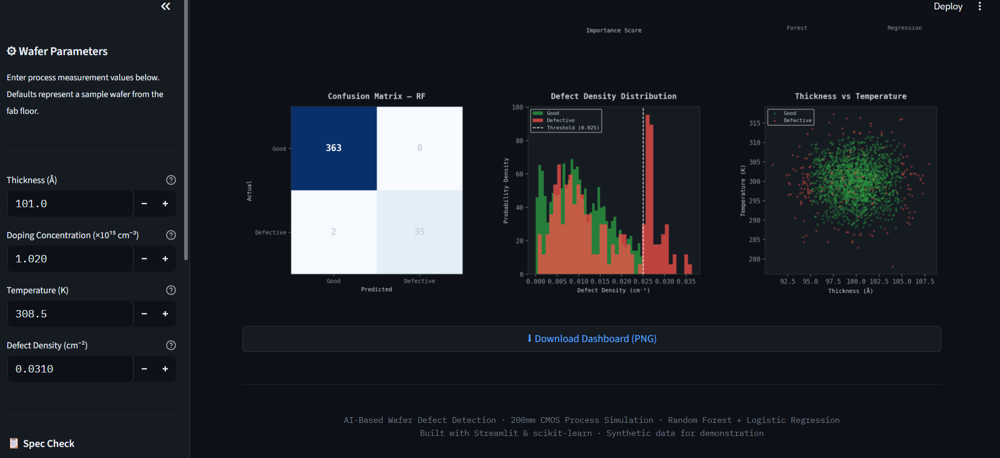
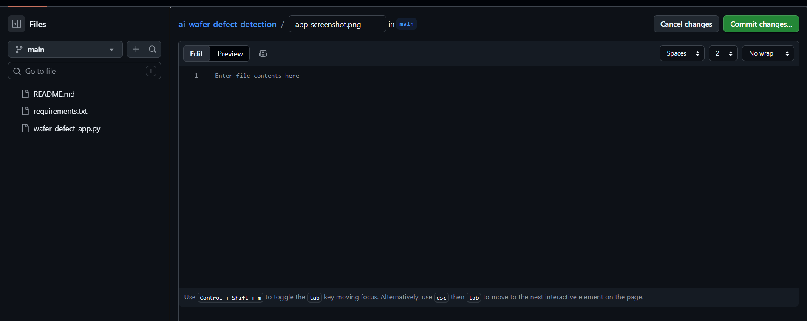
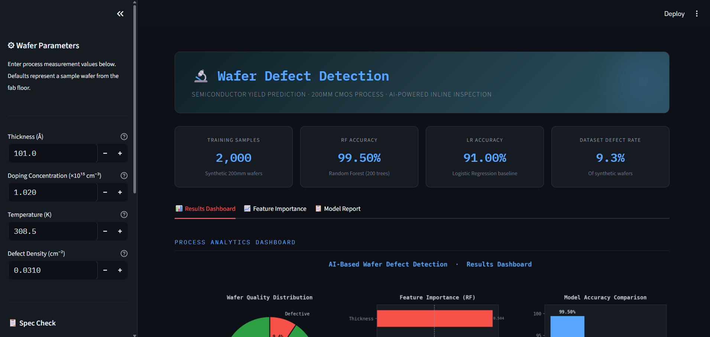
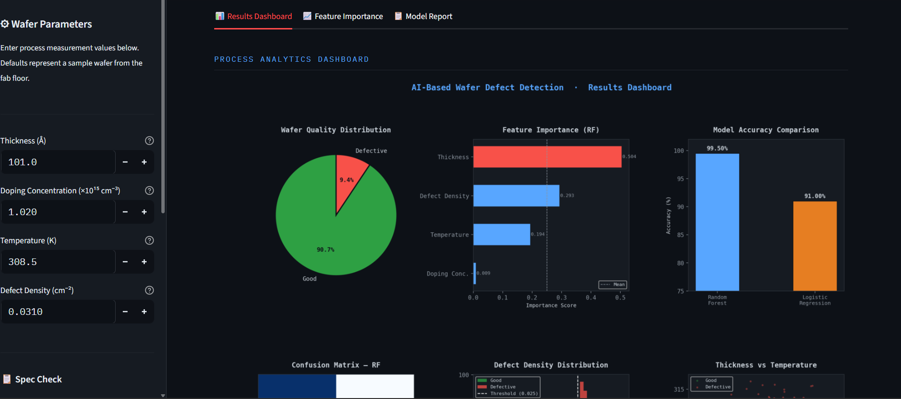

# 🔬 AI-Based Wafer Defect Detection
## 🌐 Live Demo
👉https://ai-wafer-defect-detection-v7idry7yrozeijtldbihlr.streamlit.app/
## 📸 Application Preview

---

## 🚀 Overview

This project is an AI-powered system designed to predict semiconductor wafer defects using process parameters.

It simulates real-world semiconductor manufacturing and yield prediction using Machine Learning models.

---

## 🧠 Features

* Predict wafer quality (GOOD / DEFECTIVE)
* Random Forest (high accuracy model)
* Logistic Regression (baseline comparison)
* Interactive Streamlit GUI
* Feature importance visualization
* Full analytics dashboard
* Downloadable results

---

## ⚙️ Tech Stack

* Python
* Streamlit
* Scikit-learn
* NumPy
* Pandas
* Matplotlib

---

## 📊 Input Parameters

* Thickness (Å)
* Doping Concentration
* Temperature (K)
* Defect Density

---

## 🧪 How to Use
1. Enter wafer process parameters on the left panel
2. Click predict
3. View results dashboard and feature importance
4. Download results if needed

## 🎯 Use Case

This project demonstrates how AI can be applied in semiconductor manufacturing for:

* Yield prediction
* Process optimization
* Failure analysis

---

## 💡 Key Learning

* Applied Machine Learning in manufacturing domain
* Built end-to-end AI + GUI system
* Integrated data simulation + model + visualization

---

## 👨‍💻 Author

Aryan Dubey
B.Tech Metallurgical & Materials Engineering
VNIT Nagpur

